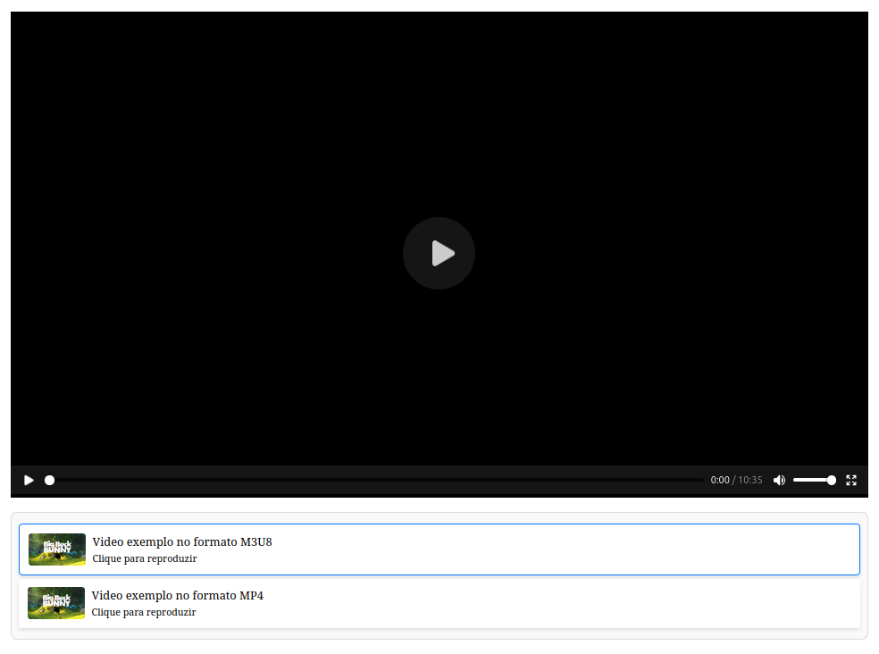

# Player de Vídeo com Playlist em HTML




Este projeto é um **player de vídeo interativo** em HTML, CSS e JavaScript, com suporte para **playlist** e reprodução de vídeos nos formatos **MP4** e **HLS** (M3U8). Ele permite que o usuário assista vídeos sequenciais, faça a gestão da playlist, e adicione novos vídeos diretamente na interface, tudo isso de forma simples e responsiva.

A aplicação utiliza a biblioteca **Hls.js** para oferecer suporte à reprodução de vídeos HLS, que é um formato amplamente usado para vídeos ao vivo e streaming.

## Funcionalidades

- **Reprodução de vídeos em formatos MP4 e HLS**: O player suporta vídeos em formato MP4 e HLS (M3U8), permitindo a reprodução de vídeos locais ou em streaming.
- **Playlist interativa**: A playlist é exibida ao lado do player e permite que o usuário clique para selecionar e reproduzir diferentes vídeos.
- **Adição de vídeos personalizados**: O usuário pode adicionar novos vídeos à playlist inserindo título, URL e miniatura, sem precisar modificar o código diretamente.
- **Controle automático de vídeo**: Após o término de um vídeo, o próximo vídeo da playlist é carregado automaticamente.
- **Design responsivo**: A interface foi projetada para ser responsiva, ajustando-se bem a diferentes tamanhos de tela (desktop, tablet e dispositivos móveis).
- **Suporte a HLS com Hls.js**: A biblioteca Hls.js foi integrada para garantir que os vídeos HLS sejam reproduzidos corretamente em navegadores que não têm suporte nativo a este formato.

## Tecnologias Utilizadas

- **HTML**: Estrutura do conteúdo da página.
- **CSS**: Estilo visual e layout responsivo.
- **JavaScript**: Funcionalidade interativa do player e da playlist.
- **Hls.js**: Biblioteca para carregar e reproduzir vídeos HLS em navegadores que não oferecem suporte nativo a esse formato.
- **JavaScript DOM**: Manipulação da playlist e eventos de vídeo.

## Como Usar

### 1. Clonando o repositório

Primeiro, clone o repositório para a sua máquina local usando Git:

```bash
git clone https://github.com/Vetroide/Vetroide-VideoPlayer.git
```
### 2. Abrindo o projeto
Após clonar o repositório, navegue até a pasta do projeto e abra o arquivo `index.html` no seu navegador favorito. A interface será carregada automaticamente.
```bash
cd player-de-video-com-playlist
open index.html
```
### 3. Interagindo com o Player

- **Reproduzir vídeos**: Clique em qualquer item da playlist para iniciar a reprodução do vídeo correspondente.
- **Adicionar novos vídeos**: Use o formulário abaixo da playlist para adicionar novos vídeos à playlist. Preencha os campos:
  - **Título**: O título do vídeo.
  - **URL**: A URL do vídeo. Pode ser um link para um arquivo MP4 ou um stream HLS (M3U8).
  - **Miniatura**: (Opcional) A URL da miniatura que aparecerá na playlist.

Após preencher o formulário, clique no botão **Adicionar**. O novo vídeo será adicionado à playlist e aparecerá com a miniatura especificada.

### 4. Visualização em diferentes dispositivos

A interface foi projetada para ser responsiva. Isso significa que ela se adapta bem a diferentes tamanhos de tela, como em dispositivos móveis, tablets e desktops.

- **Na tela de desktop**, o player de vídeo ocupa a maior parte da tela, com a playlist exibida ao lado.
- **Em dispositivos móveis**, a playlist pode ser exibida em uma lista simples abaixo do player, com a mesma funcionalidade.

## Estrutura do Projeto

Abaixo está a estrutura de pastas e arquivos do projeto:
```
/Vetroide-VideoPlayer
│
├── index.html           # Página principal com o player de vídeo e playlist.
├── README.md            # Este arquivo com as instruções do projeto.
├── /css
│   └── style.css        # Estilos da página.
├── /js
│   └── script.js        # Funcionalidade JavaScript para controle de vídeos e playlist.
└── /assets
    └── video-thumb.jpg  # Exemplo de miniatura para vídeos.
```
### Explicação dos Arquivos

- **`index.html`**: Contém a estrutura da página e a exibição do player de vídeo e playlist. É aqui que você encontrará o layout principal e o código HTML que organiza os componentes da interface.
- **`style.css`**: Arquivo CSS responsável pelos estilos do player, da playlist e da interface de usuário. Inclui design responsivo para garantir que o projeto funcione bem em diferentes dispositivos.
- **`script.js`**: Arquivo JavaScript que controla a lógica do player de vídeo. Isso inclui a funcionalidade de carregar vídeos da playlist, adicionar novos vídeos e manipular eventos do player.
- **`assets/video-thumb.jpg`**: Um arquivo de miniatura de exemplo, usado como padrão caso o usuário não forneça uma miniatura personalizada.

## Como Contribuir

Este projeto é de código aberto, e contribuições são bem-vindas! Se você gostaria de melhorar o projeto, adicionar novos recursos ou corrigir erros, sinta-se à vontade para enviar um pull request.

### Passos para contribuir:

1. **Faça um fork** do repositório.
2. **Clone** o seu fork na sua máquina local:

   ```bash
   git clone https://github.com/Vetroide/Vetroide-VideoPlayer.git
   ```

3. Crie uma nova branch para suas alterações:

   ```bash
   git checkout -b nova-funcionalidade
   ```

4. **Faça suas alterações**: Implemente suas melhorias ou correções.
5. **Commit** suas mudanças:

   ```bash
   git commit -am 'Adicionando nova funcionalidade'
   ```

6. **Envie** suas alterações para o repositório remoto:

   ```bash
   git push origin nova-funcionalidade
   ```

7. Abra um **pull request** explicando suas alterações.

## Melhorias Futuras

Aqui estão algumas melhorias e recursos adicionais que podem ser implementados:

- **Controle manual da reprodução**: Adicionar controles para pausar, voltar ou avançar o vídeo manualmente.
- **Modo de tela cheia**: Permitir que o vídeo seja exibido em tela cheia, com suporte a diferentes resoluções.
- **Armazenamento local**: Salvar a playlist no armazenamento local do navegador, para que ela persista entre sessões.
- **Suporte a mais formatos de vídeo**: Expandir o suporte para mais formatos de vídeo (como WebM, Ogg, etc.).
- **Pesquisa na playlist**: Implementar uma funcionalidade de pesquisa para filtrar vídeos na playlist.

Feito por [Vetroide](https://github.com/Vetroide).
